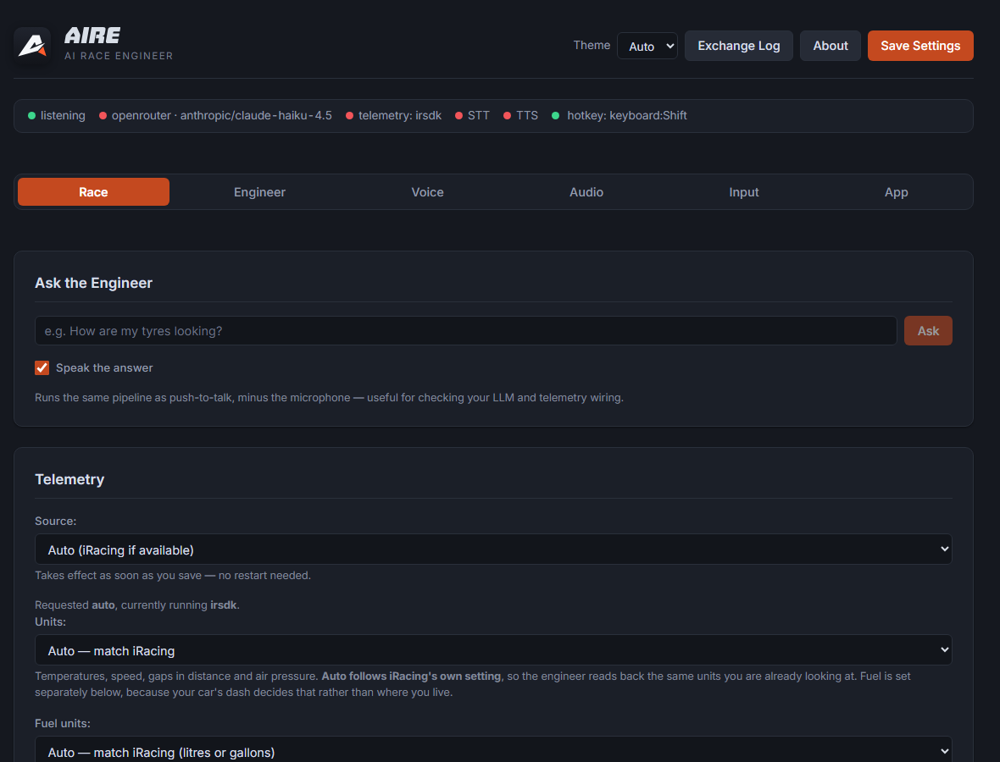
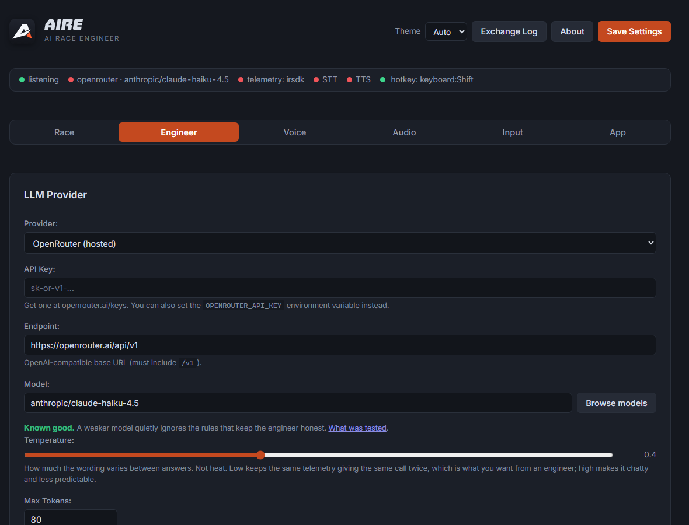
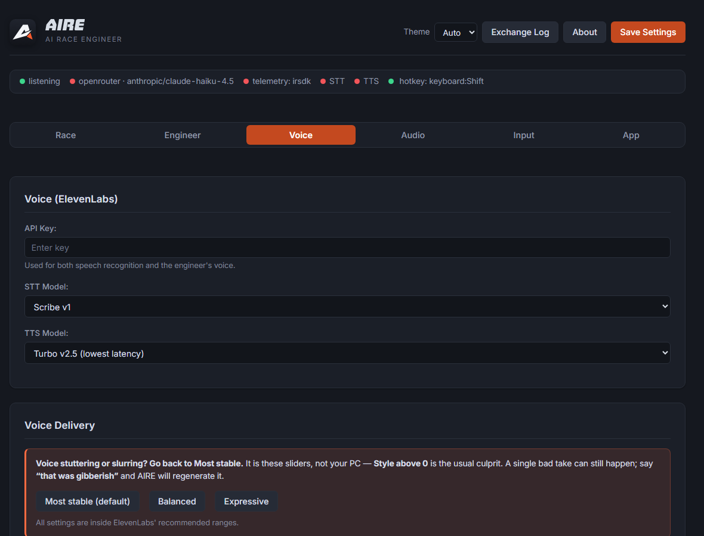
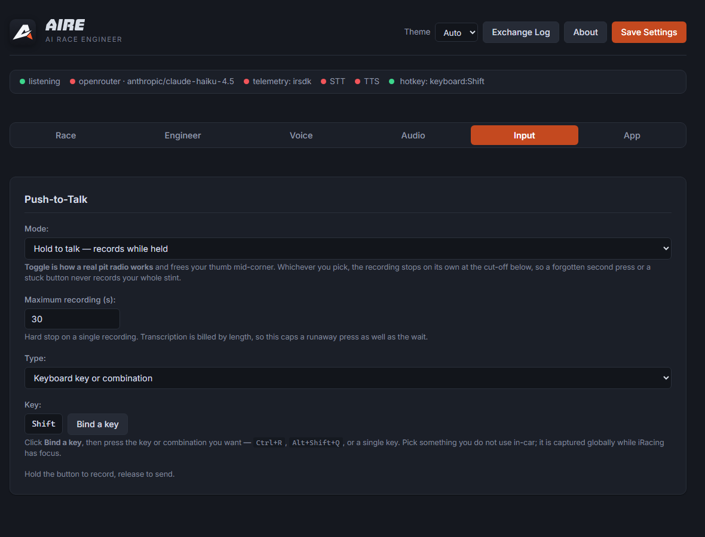
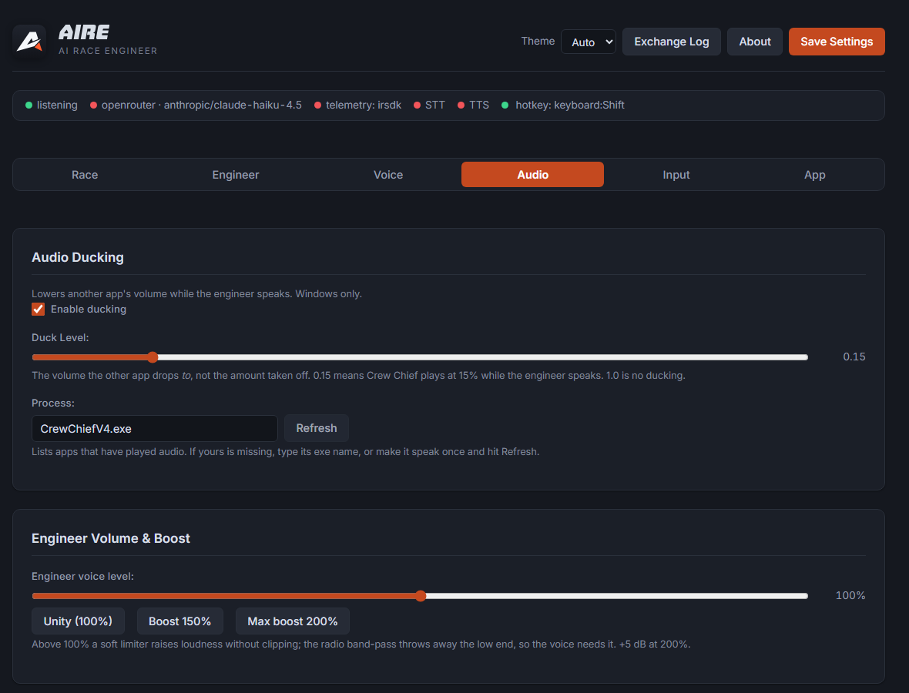

<div align="center">


# AIRE

**A race engineer you can actually talk to, for iRacing.**

[](LICENSE)
[](#quick-start-windows)
[](#build-from-source)
<!-- Buy Me a Coffee: swap USERNAME for your handle and delete these comment
     markers. Left disabled so a dead donation link never ships.
[](https://buymeacoffee.com/USERNAME)
-->

</div>

Hold a button on your wheel, ask a question out loud, and get a short spoken
answer grounded in live telemetry — delivered through a pit-radio effect.

> *"How's my fuel?"* — "You're two litres short with eleven to go, save a tenth a lap."
>
> *"Am I catching him?"* — "Three tenths a lap quicker, you'll have him in six."
>
> *"How are my brakes?"* — "I've got no reading on your brakes."

There is no command list. Say it however you say it.

AIRE is an independent community project. It is not affiliated with, endorsed
by, or supported by iRacing.com Motorsport Simulations, LLC. iRacing is a
trademark of its respective owner.



<sub>The dots along the top are a live readiness check — engineer, telemetry,
speech, and your push-to-talk button. Green is ready, red is not.</sub>

---

## Quick start (Windows)

No Python, terminal, or installer is needed. You need Windows 10 or 11,
iRacing, and accounts with:

- **ElevenLabs** for speech recognition and the engineer's voice
- **OpenRouter** for the language model that understands your question

Both services use your own API key and may require credits. AIRE does not
include or resell either service; a typical question has measured about
$0.015 across both providers. See [Running costs](#running-costs).

### 1. Download and extract AIRE

Open the **[latest release](https://github.com/Bartket/AIRE/releases/latest)**
and download the file named `AIRE-...-win64.zip`. Do not download GitHub's
automatically generated **Source code** archives.

Right-click the downloaded zip, choose **Extract All**, open the extracted
folder, and run `AIRE.exe`. Keep the whole folder together; the executable
needs the files beside it. There is no installer and no Python setup.

The current build is not code-signed, so Windows SmartScreen may ask you to
confirm the first launch. Only continue when the file came from the official
release page above, and compare its SHA-256 checksum with the value in the
release notes.

### 2. Connect the engineer — OpenRouter

1. Create an account at [OpenRouter](https://openrouter.ai/), then create an
   API key under [Keys](https://openrouter.ai/settings/keys).
2. In AIRE, open **Engineer**, paste the key into **API Key**, and leave the
   default model selected for the first run.
3. Click **Save Settings**, then **Test connection**. A successful test shows
   the model's short reply below the button.

The default model is chosen because it passed AIRE's behavior smoke test.
Changing to a weaker model can produce fluent but unsafe answers. OpenRouter
charges your OpenRouter account; its dashboard shows the exact usage.



### 3. Connect speech and choose a voice — ElevenLabs

1. Create an account at [ElevenLabs](https://elevenlabs.io/), then create an
   API key under [API Keys](https://elevenlabs.io/app/settings/api-keys). A
   restricted key must allow Speech to Text, Text to Speech, and reading
   voices.
2. In AIRE, open **Voice**, paste the key into **API Key**, and click
   **Save Settings**. Saving first matters: **Load voices** uses the saved key.
3. Click **Load voices**, choose an available voice, then click **Preview
   through radio**. If a library voice is unavailable on your ElevenLabs plan,
   AIRE greys it out instead of failing during a race.

Start with the shipped **Most stable** voice preset. If one generated line
still glitches, say **“that was gibberish”** over push-to-talk; AIRE regenerates
the line and replaces the bad cached take.



### 4. Select your microphone and speakers

Open **Audio** and choose the microphone used for your radio button and the
headphones or speakers where AIRE should answer. Return to **Voice** and use
**Preview dry** to prove that the voice, output device, and volume work before
adding the radio effect.

### 5. Bind push-to-talk

1. Open **Input** and choose **Sim Wheel / Button Box** or **Keyboard key or
   combination**.
2. Click **Bind a button** or **Bind a key**, then press the control you want.
3. Click **Save Settings**. The status bar must show the binding with a green
   dot; changing the input type is not live until it is saved.

Choose **Toggle** to press once to open the radio and once more to send, or
**Hold** to record only while the button is held. AIRE stops any recording at
the configured maximum, even if a button sticks.



### 6. Match the car's units

On **Race**, leave **Source** and **Units** on `Auto`. Set **Fuel units** to
what the current car's dashboard shows: litres, kilograms, or US gallons.
iRacing does not publish which unit an individual car dashboard uses, so AIRE
cannot safely choose kilograms automatically.

Leave **Pit commands — at my own risk** off for the first run. It is the only
feature that writes to the sim and has its own [safety workflow](#pit-stop-commands-opt-in-at-your-own-risk).

### 7. Test, then race

For a test without iRacing, temporarily choose **Race → Source → Simulated**,
save, type *“How's my fuel?”* into **Ask the Engineer**, and leave **Speak the
answer** checked. Return Source to `Auto` afterward.

Then start iRacing and enter a session. The top status bar should show green
dots for the engineer, telemetry, STT, TTS, and your push-to-talk binding.
Press the bound control and ask naturally—there is no question command list.

Closing the AIRE window hides it in the system tray so push-to-talk keeps
working while iRacing is fullscreen. Use the tray icon to reopen or quit it.

### First-run troubleshooting

| Problem | Check |
| --- | --- |
| **Load voices fails** | Save the ElevenLabs key first, then reload voices. |
| **No sound** | Select the output under Audio, try Preview dry, then check AIRE's volume. |
| **Push-to-talk does nothing** | Save after changing its type and check that the status-bar binding is green. |
| **Telemetry stays red** | Start iRacing, enter a session, and use Race → Source → Auto or iRacing. |
| **Voice stutters or produces nonsense** | Apply Most stable, keep Style at 0, or say “that was gibberish” to regenerate the last line. |
| **The window disappeared** | AIRE is still running in the Windows system tray. |
| **The window is blank** | Install or repair the Microsoft Edge WebView2 Runtime, then restart AIRE. |

### Updating AIRE

Quit AIRE from its tray icon, download and extract the new release into a new
folder, then run the new `AIRE.exe`. Your keys, bindings, favourites and speech
cache stay under `%APPDATA%\AIRE`, so an update does not require configuring
the app again. Delete the old extracted folder after the new version works.

---

## Privacy and data flow

AIRE has no account, analytics, advertising, crash reporter, or service of its
own. It does use the providers you configure:

- Your recorded push-to-talk audio is sent to **ElevenLabs** for transcription.
- The transcript, the engineer instructions, and the relevant iRacing reading
  — which may include driver names, car numbers and session information — are
  sent to **OpenRouter** and the model provider selected there. A local LLM
  keeps this step on your machine instead.
- The engineer's answer text is sent to **ElevenLabs** to synthesize speech.

Those services handle data under their own terms and retention settings. Read
the [ElevenLabs privacy policy](https://elevenlabs.io/privacy-policy) and the
[OpenRouter privacy policy](https://openrouter.ai/privacy/) before adding keys.

On the computer, AIRE stores API keys in plain text in
`%APPDATA%\AIRE\config.json`. Treat that file like a password. Synthesized
answers may be stored in `speech-cache\` so repeated lines do not cost money;
the cache can be cleared under **Voice → Speech Cache**. The exchange log is
memory-only and disappears when AIRE exits. Diagnostic recording is off by
default; when enabled, `diagnostic-trace.jsonl` contains radio text, driver
names and telemetry.

To remove all local AIRE data, quit it, delete the extracted application
folder, then delete `%APPDATA%\AIRE`. Never post `config.json` or an unreviewed
diagnostic trace in a public issue.

---

## Features

- **Ask anything, however you phrase it** — no command list to learn
- **Deterministic race maths** — fuel, pit windows, gaps and pace computed in
  Python, never guessed by the model
- **Refuses rather than inventing** — a missing reading gets *"I've got no
  reading on that"*, not a plausible number
- **Knows the session** — race, qualifying, practice and Test Drive each get
  different treatment
- **Talks properly after the flag** — the one-sentence limit lifts, so you can
  have a conversation on the slow-down lap
- **Sim wheel push-to-talk**, hold or toggle, with a recording cut-off
- **Opt-in pit commands**, held until a separate spoken confirmation
- **Broadcast pit-radio effect** — band-pass, comms AGC, squelch
- **Ducks other Apps** while the engineer speaks
- **Light and dark themes**, and about 0.3% of a modern CPU

---

### What the engineer knows

| Area | Reads |
| --- | --- |
| **Position** | Live on-track order (not just the last start/finish crossing), class position, full running order with gaps |
| **Rivals** | Names, car numbers, gaps in seconds and metres, laps down, who is in the pits |
| **Pace** | Lap times as `m:ss.mmm`, best, last, rolling average, delta to your best and to the session best, and the trend across recent clean laps |
| **Fuel** | Volume on board, measured burn per clean lap, range, and whether it reaches the end — in litres, kilograms or gallons to match your dash |
| **Tyres** | Tread and carcass temperature across three strips per tyre, wear, age |
| **Car** | Repair seconds outstanding, tow state, fast repairs left, dashboard warning lights, engine temps and pressures |
| **Session** | Type, state, laps or time remaining, flags, incident count and limit |
| **Race history** | Grid slot, position at every lap, which laps were pit or scrappy laps and why, best lap and which lap it was, laps led, cautions |
| **Weather** | Track and air temperature, wetness, rain, wind, humidity, pressure, skies, track clock |

### Arithmetic is done in Python, not by the model

Fuel sums, pit windows, gaps and pace comparisons run as
[deterministic calculations](ai_race_engineer/race_math.py) that the model calls
as tools. It never does mental arithmetic — the reason being that a language
model doing a fuel sum produces a confident, plausible, wrong number, and the
driver cannot check it at speed.

Models without tool support still work: the same sums are computed up front and
folded into the context instead.

### It will not invent anything

If a reading is missing, the engineer says so and stops. It will not estimate,
reuse a stale value, or name a corner it was never given. Refusals stay in
character — you get *"I've got no reading on your brakes"*, not a description of
a missing data channel.

### Speech recognition is biased toward your session

Driver surnames, car numbers and the track name from the live session are sent
to the recogniser as hints, so names a general model has never seen still land.
In testing, a hard surname went from 0/3 to 3/3 correct with the hint present.

---

## Questions it supports

Phrasing does not matter — these are examples, not commands.

**Position and the field**
> Where am I? · How far ahead is the leader? · Who's fastest out there? ·
> What's the top five? · Where's car 44? · Who's behind me?

**Racing someone**
> Am I catching him? · How long until he's on me? · How much quicker is
> Silva? · Is the car behind faster than me?

**Asking about one car** — by name, position, number, or just "ahead"
> What's the car ahead's last lap? · What's P4's best? · How's Silva doing? ·
> What's his iRating? · Is he on the same tyres as me?

Last lap and best lap answer different questions: best is whether they were
ever quick, last is whether they are quick *now*. A rival well off his own
best is a rival in trouble, and the engineer says so. Tyres are reported as
same or different. iRacing publishes the player's compound-name mapping, but
not enough to name every rival's tyres safely in a mixed-car field.

**Fuel and strategy**
> Can we make the end on fuel? · When's my pit window? · How much do I need
> to save? · How many laps of fuel have I got? · How much fuel for the next
> twenty minutes?

### Pit stop commands: opt-in, at your own risk

Pit commands are the one feature that writes to iRacing. They ship off. Enable
**Pit commands — at my own risk** on the Race tab only if you accept that a
misheard radio command can change the car at the next stop.

Speak to it as you would a human engineer; the wording is not a command list:

> Box me for wets and thirty litres · Give me four tyres at 21 PSI · Add eight
> gallons and take the tear-off · No tyres this stop · Turn refuelling back on
> · Clear everything

Questions remain questions: *“Should I take wets?”* or *“How much fuel do I
need?”* cannot arm a command. For an instruction, the LLM produces a restricted
local proposal; it cannot write to iRacing. A deterministic parser rejects
unsupported services, unavailable tyre types, and any fuel or pressure amount
that was invented, converted, or omitted.

AIRE reads back the exact settings it parsed and does nothing yet. Say
**confirm** in the next transmission to commit them, or **cancel** to discard
them. Any unrelated transmission, a 30-second delay, a session change, or
turning the setting off also discards the pending command. Fuel calculations
and ordinary answers never set the pit stop.

“Enable refuelling” or “turn refuelling back on” rechecks fuel service at the
amount already selected. It does not mean fill the tank or calculate a new
amount; say the quantity explicitly to replace that amount.

Fuel is sent to iRacing as whole litres and pressures as whole kPa, as required
by pyirsdk. US gallons and PSI are converted first, and the converted values are
the ones read back for confirmation. The command is reported as set only after
iRacing publishes the requested checkbox, fuel amount, and pressure state.
Named tyre types use the live `DriverInfo:DriverTires` mapping for the current
car and are refused when that mapping or the requested type is unavailable.

**Tyres**
> How are my tyres? · Why is my front left going off? · How much tread is
> left? · Are they overheating?

**Pace and degradation**
> What was my last lap? · What's my best? · Am I up or down? ·
> Are my tyres going off? · Am I being consistent? · Should I push or manage?

**Car and trouble**
> How bad is the damage? · Have I got a problem? · How many incidents have I
> got? · What's this warning light? · Do I have a penalty?

A black flag means two different things, and they need different driving: on
its own it is a stop-and-go, with the furled flag it is a slow-down. The
engineer tells them apart.

**How the race has gone**
> How's my race going? · Where did I start? · How many places have I made up? ·
> When did I stop? · Have I led any laps? · Which was my best lap?

It watched the shape of the race, not the incidents in it. It knows you started
P7, ran as high as P5, dropped two across the stop and are P4 now — because
every one of those is a position iRacing published at a start/finish crossing.
It does not know who took a place off you, and it will not guess.

**Session**
> How long left? · Is the race over? · What's the flag? · What lap am I on?

**Weather**
> What's the track doing? · Is it wet? · How's the wind?

**Practice and qualifying**
> How's my pace looking? · Am I being consistent? · Are the tyres coming to me? ·
> How far off the session best am I? · How long is left?

The engineer knows which session it is in — including Test Drive, which
iRacing reports as `Offline Testing` and which is treated as practice. In qualifying it talks about your
best lap against the session best and your grid slot; in practice about
consistency and what the tyre temperatures suggest. Fuel-to-the-finish and pit
windows are race concepts, so it says so rather than inventing a race distance
out of the session clock.

**After the flag**
> How did that go? · Was I far off the win? · What should I work on?

The one-sentence limit lifts once the session ends, so the engineer will hold
a conversation on the slow-down lap — using your name, reacting to the result,
and reporting your finishing position rather than a live one. It can walk back
through where you started, where the race went and which laps hurt.

What it still has no record of is *why*. Ask what cost you a place and it will
say it needs to look at the data: it can tell you the lap you lost the position
on, never who took it or what happened. That line is deliberate — the debrief is
allowed to invent warmth, never events.

---

## Configuration

Everything is in the settings panel, grouped by tab. The same values live in
`config.json` if you would rather edit that — see
[config.json.example](config.json.example) for the full schema.

| Tab | What is there |
| --- | --- |
| **Race** | Ask by text, telemetry source, units, fuel units, opt-in pit commands, live readout |
| **Engineer** | LLM provider, key, model, temperature, tool calling, timeout, what to call you, system prompt |
| **Voice** | ElevenLabs key, STT/TTS models, voice picker, delivery settings, speech cache, radio effect |
| **Audio** | Input/output devices, engineer volume and boost, radio blips, Audio ducking |
| **Input** | Push-to-talk mode, recording cut-off, keyboard or wheel binding |
| **App** | Hide-to-tray behavior, defaults, process priority |

Config lives at `%APPDATA%\AIRE\config.json` on Windows, or
`~/.config/AIRE/config.json` elsewhere. Point elsewhere with
`--config path.json` or the `AIRE_CONFIG` environment variable.

Secrets can come from the environment instead of the file:

| Variable | Used for |
| --- | --- |
| `OPENROUTER_API_KEY` | OpenRouter |
| `ELEVENLABS_API_KEY` | Speech recognition and the engineer's voice |
| `AIRE_CONFIG` | Config file location |

### LLM providers

The client speaks the OpenAI `/chat/completions` protocol, so both providers
share one code path and differ only in base URL, model, and auth.

#### OpenRouter (default)

```jsonc
"llm": {
  "provider": "openrouter",
  "openrouter": {
    "api_key": "",                              // or $OPENROUTER_API_KEY
    "endpoint": "https://openrouter.ai/api/v1",
    "model": "anthropic/claude-haiku-4.5"
  }
}
```

Get a key at <https://openrouter.ai/settings/keys>.

**Model choice matters more than it looks.** The engineer's rules — never
invent a reading, always call the calculators, one sentence at racing speed —
are enforced by the prompt, not by code. Stronger models follow them; weaker
ones quietly do not, and a confident wrong answer is the failure that matters
when the driver cannot check you.

A short smoke test — thirteen assertions over six questions, one run each —
covering the failure modes this app actually hit: invented corner names, mental
arithmetic, ignored tool calls, and answers running past a sentence.

| Model | Smoke test |
| --- | --- |
| `anthropic/claude-haiku-4.5` | clean — the default, and what the prompts were written against |
| `google/gemini-2.5-flash` | clean, and cheaper |
| `google/gemini-2.5-flash-lite` | **fails** — skipped tool calls, twice returned nothing at all |

Read that asymmetrically. A failure is solid evidence a model will not do the
job; a pass only means it did not trip these particular wires on one run. It is
a floor, not a ranking, and it says nothing about how either model holds up over
a full race. Anything not listed works at your own risk. Model slugs change over time — click
**Browse models** in the web UI (or `GET /api/llm/models`) to pull the live
catalogue rather than guessing. Prefer a fast, cheap model: answers are capped
at roughly one sentence, and latency is what you feel on track.

#### Local (Ollama, LM Studio, vLLM)

```jsonc
"llm": {
  "provider": "local",
  "local": {
    "api_key": "",
    "endpoint": "http://127.0.0.1:11434/v1",    // note the /v1 suffix
    "model": "qwen2.5:14b-instruct-q4_K_M"
  }
}
```

Two settings worth knowing about, both on the **Engineer** tab:

- **Calculations** — `auto` lets the model call the fuel, pit-window, gap and
  pace functions as tools. Set it to `off` for a local model that handles tool
  calling badly: the same figures are computed in Python either way and folded
  into the prompt instead, in one round trip rather than two.
- **Timeout** — how long to wait before giving up. A stalled provider should go
  quiet rather than answer a corner too late.

##### Reasoning models think on the same budget they speak with

Max Tokens is 80 because the engineer says one sentence. A reasoning model —
Qwen3, DeepSeek-R1 and friends — charges its thinking to that same budget, hits
the ceiling mid-thought, and returns a finished thought and no words at all.

AIRE detects that and asks again with room, once per session, so these models
work without any configuration. **But look at what it costs:**

| `qwen3.6:latest`, 36B MoE Q4, local | |
| --- | --- |
| thinking, tools called correctly | **8–17 s** an answer |
| thinking disabled (`reasoning_effort: none`) | ~1 s an answer |

The fast column is a trap. With thinking off, that model **stopped calling the
calculators** and answered *"you can pit any time from the next lap to the end
of the race"* — invented, confident, and exactly the failure this app exists to
avoid. With thinking on it called `pit_window` and got it right.

So a local reasoning model is correct but slow. Fine for testing prompts, hard
to use at racing speed. A non-reasoning instruct model of similar size is the
better local choice.

**Local models are the weakest case.** Tool calling is inconsistent across
Ollama builds, which is what the **Calculations → off** setting is for: the
same figures are computed in Python either way and folded into the prompt, so
a model that cannot call tools still gets correct numbers. It will still be
looser about brevity and about refusing rather than guessing.

Switch providers from the UI, in `config.json`, or per run:

```bash
python -m ai_race_engineer --provider local --model llama3.2
```

### Choosing a voice

**Load voices** lists what is attached to your ElevenLabs account, not the
ElevenLabs catalogue. That means:

- the **premade** voices every account gets
- any **Voice Library** voices you have explicitly added to your account
- any voices you have **cloned or designed** yourself

The public Voice Library — thousands of community voices — is not in that
response at all, which is why the list looks short. A voice appears here only
once you have added it at
<https://elevenlabs.io/app/voice-library> ("Add to my voices"), after which
**Reload voices** picks it up. Nothing to change in AIRE.

AIRE hides nothing from the list. Library voices are greyed with a badge when
your account tier cannot synthesize them (free plans only) rather than being
dropped, so what you see is everything the API returned.

Worth auditioning more than one. Voices differ a lot on short, clipped radio
lines, and one that reads a paragraph beautifully can slur a two-second call —
use **Preview through radio** to hear candidates through the full chain rather
than judging them on the ElevenLabs site.

### Units

**Race → Units** sets everything that carries one: temperatures, speed, gaps
given in distance, and air pressure. `Auto` follows iRacing's own setting, so
the engineer reads back the units you are already looking at on your own
screen.

Fuel is set separately, and deliberately. Which fuel unit is right depends on
what your **car's dashboard** shows rather than where you live — plenty of
cars read out fuel *mass* in kilograms, and no channel announces that.

### ElevenLabs voice delivery

**Voice Delivery** exposes the ElevenLabs `voice_settings`:

| Setting | Range | Notes |
| --- | --- | --- |
| Stability | 0–1 | **Low = more variation and emotion, high = flatter.** Ships at 0.75 — artifacting costs you the whole answer, and expression is worth little on a pit radio. |
| Similarity | 0–1 | How closely it tracks the original voice. |
| Speed | 0.7–1.2 | Engineers talk slightly fast; 1.05–1.1 reads well. |
| Style | 0–1 | Style exaggeration. Adds latency, not supported by every model — leave at 0. |
| Speaker boost | on/off | Fuller voice, slightly slower. |

Style, speaker boost, and speed are only sent when they differ from neutral, so
a model that does not support them never receives them. Use **Preview through
radio** to hear the result through the full chain.

The three presets are one axis — consistency against expression — and all keep
Style at 0. Defaults ship on **Most stable**; if the voice ever stutters or
slurs, that is where to go back to.

ElevenLabs can still produce a single corrupt take unpredictably. Say **“that
was gibberish”**, **“your voice glitched”**, or **“say again”** and AIRE
regenerates the last spoken line without asking the language model again. The
replacement also evicts that phrase's bad cached audio.

**Star a voice** with the ☆ on its card to keep it at the top of the list. A
library runs to dozens of entries and the good ones are found by ear, one
preview at a time; favourites survive a settings reset for that reason.

### When the voice mangles a name

**Voice → Say it like this** fixes names the voice stumbles over.

The tell is that it is *intermittent* — a name comes out clean once and
slurred the next time. That is the voice being unsure of the spelling rather
than getting it consistently wrong, and uncertainty shows up as artefacts.
Give it a spelling it is sure of and it says the same thing every time.

Three things happen, in order, and the first two need no setup:

1. **Track names are shortened** to what an engineer says on the radio —
   `Circuit de Spa-Francorchamps` is spoken as **Spa**.
2. **Accents are folded** — `Kovács` goes out as `Kovacs`. Not a correct
   pronunciation, but a stable one, which is the thing that was missing.
3. **Risky driver names become car numbers.** iRacing has hundreds of
   thousands of drivers, so this works out which names the voice will fight
   rather than keeping a list of them — a surname with an awkward letter
   pair or a run of four consonants is spoken as *"car 44"* instead.
   **Guessing wrong is invisible**: a real engineer says the car number
   half the time anyway, so the wrong branch is still a correct radio call.
   Switch it off under **Hard-to-say names** if you would rather always
   hear names.

**Say it like this** is only for when you want a specific spelling. It
always wins over the automatic car number.

**Only the audio changes.** The engineer still knows the real name, and the
exchange log still records it — so what you read back is what was said, not
what was spoken.

### What the engineer calls you

**Engineer → Call me** sets the name spoken on the radio. iRacing supplies your
full name and the voice mispronounces some of them — a name mangled on every
answer is worse than no name. Set something short you like hearing. Your real
name stays available if you ask for it directly, but is never volunteered.
Leave it blank to use whatever the sim supplies.

<p align="center">

</p>

### Engineer voice volume

**Audio → Engineer voice level** scales spoken answers from 0–200%,
so you can balance the engineer against sim and other audio apps without
touching the Windows mixer. It applies to the radio preview too, so what you
audition is what you get.

### Radio effect

Tuned after the way F1/WEC pit radio sounds on a world feed, not after
analogue static. In order of how much each contributes:

| Setting | Default | What it does |
| --- | --- | --- |
| `compression` | `0.65` | Comms AGC. Evens out loud and quiet words — most of the effect. |
| `intensity` | `0.85` | Band-pass narrowness + saturation. `1.0` gives a 400–3000 Hz comms band. |
| `squelch` | `true` | Mic click as the transmission opens and closes. |
| `noise` | `0.08` | Band-limited noise bed. Real race radio is nearly clean. |
| `low_cut` / `high_cut` | `350` / `3200` | Band edges at full intensity. |

`noise` is deliberately separate from `intensity`, so you can run a strong
radio character without dragging a hiss bed along with it. It is also
band-limited to the voice band — full-spectrum noise is what makes a radio
effect sound like tape hiss.

Presets worth trying:

- **Broadcast F1** (default): `intensity 0.85`, `compression 0.65`, `noise 0.08`
- **Digital clear** — modern, no noise at all: `noise 0`, `intensity 0.9`
- **Older analogue feel**: `noise 0.25`, `intensity 1.0`, `compression 0.8`
- **Subtle** — barely coloured: `intensity 0.4`, `compression 0.3`, `noise 0`

Use **Preview through radio** / **Preview dry** in the panel to A/B them; that
needs an ElevenLabs key, since it runs a real synthesized line through the chain.

### Speech cache

Speech is billed per character every time, even for phrases the engineer has
said a hundred times. Refusals are word-for-word identical by design, and
within a session the same question tends to produce the same answer — so
synthesized audio is kept on disk and replayed.

Repeats are **free, and about 25x faster** than synthesizing again (0.012 s
against 0.30 s), which also takes a chunk out of the latency you feel on
track.

| Setting | Default | Notes |
| --- | --- | --- |
| `elevenlabs.cache_speech` | `true` | Turn off to always synthesize afresh |
| `elevenlabs.cache_mb` | `128` | Least-recently-used phrases drop past this; `0` disables |

What is stored is the raw audio from ElevenLabs, *before* the radio effect and
volume — those are local DSP that costs nothing to redo, and you change them
often. The cache key covers the text, voice, model and every voice setting, so
changing stability or speed produces new audio rather than serving the old
recording. It lives in `speech-cache/` beside `config.json`, because the
phrases worth caching repeat across sessions rather than within one.

**Voice → Speech Cache** shows the hit rate and clears it.

### Telemetry sources

`telemetry.source` accepts:

- `auto` (default) — iRacing when `irsdk` imports, otherwise simulated
- `irsdk` — iRacing shared memory only
- `simulated` — synthetic lap data, no sim required

Adding another sim means implementing `TelemetryAdapter` in
[ai_race_engineer/telemetry/](ai_race_engineer/telemetry/) and registering it in
`create_telemetry_adapter()`.

---

## Performance

One setting, on the **App** tab: *Give the sim priority over AIRE*. On by
default, and worth leaving on.

It runs AIRE below normal priority, so when the sim and the engineer want the
same core at the same instant, the sim wins. It costs nothing when the machine
is idle — priority decides who is scheduled under contention, not how fast a
thread runs.

Idle, AIRE is about **0.3% of a modern CPU**. It is the bursts that matter:
answering peaks near **56% of one core** while speech decoding, the radio effect
and playback land in the same second. Sim racing cares about the worst frame,
not the average one, which is what the priority setting is for.

---

## Known limits

It is **not a spotter** — never rely on it for something you needed to know
half a second ago. Answers take a couple of seconds.

Running cost is roughly $0.015 a question, so about $0.45–$0.90 for a race in
which you ask 30–60.

---

## Running costs

AIRE itself has no subscription. You supply your own API keys and pay the
providers directly. Measured against `anthropic/claude-haiku-4.5` and
ElevenLabs Turbo:

| Component | Per question |
| --- | --- |
| ElevenLabs TTS — ~78 characters at 0.5 credits/char | $0.0071 |
| LLM — two round trips, ~2,300 prompt tokens | $0.0053 |
| ElevenLabs STT — Scribe at 330 credits/min, ~3 s of audio | $0.0030 |
| **Total** | **~$0.015** |

A race in which you ask 30–60 questions costs roughly **$0.45–0.90**.
Provider prices and credit plans can change, so treat these as measured usage,
not a quote; the provider dashboards are authoritative for your account.

Figures are measured, not estimated: answers average 78 characters, which is
the 25-word limit doing its job.

**Speech is the largest single line, at about 46%.** If that matters:

- The **speech cache** is on by default and makes every repeated phrase free
  — see below
- Point `llm.provider` at a local server and the LLM cost goes to zero
- Lower `elevenlabs.tts_model` to a Flash model, or shorten answers, to cut
  the largest line item
- Roughly 1,340 of the ~2,300 prompt tokens are the same system prompt and
  tool schemas on every call, so prompt caching has real headroom

---

## Build from source

```bash
git clone https://github.com/Bartket/AIRE.git
cd AIRE

uv sync                        # creates .venv and installs from uv.lock
```

Get [uv](https://docs.astral.sh/uv/) with `pip install uv`, or the standalone
installer. `uv sync` fetches a suitable Python if the machine has none.

Prefer pip? `requirements.txt` is exported from the lock and still works:

```bash
python -m venv .venv
source .venv/bin/activate      # Linux/macOS
# .venv\Scripts\activate       # Windows
pip install -r requirements.txt
```

Python 3.10+. `pyirsdk` and `pycaw` install only on Windows; everywhere else the
app falls back to simulated telemetry and skips ducking.

Dependencies are declared in `pyproject.toml` and pinned by `uv.lock`, so a
build months from now produces what it does today. After changing a dependency,
run `uv lock` and regenerate the pip fallback:

```bash
uv export --no-dev --no-hashes --no-emit-project --no-annotate -o requirements.txt
```

### Building the Windows executable

```powershell
powershell -ExecutionPolicy Bypass -File build_windows.ps1
```

Installs dependencies, regenerates the icon, and runs PyInstaller against
[AIRE.spec](AIRE.spec). The result is `dist\AIRE\AIRE.exe`
(~168 MB — it embeds Python, SciPy and the WebView2 bindings), in roughly 30
seconds. It also creates `AIRE-vX.Y.Z-win64.zip` and `SHA256SUMS.txt` under
`dist\`. `-SkipInstall` reuses the existing environment; `-NoUv` forces pip.

### Usage

```bash
python -m ai_race_engineer                      # web UI + background loop
python -m ai_race_engineer --desktop            # native window + tray icon
python -m ai_race_engineer --desktop --minimized # start hidden in the tray
python -m ai_race_engineer --desktop --no-tray  # close button quits
python -m ai_race_engineer --simulate           # force simulated telemetry
python -m ai_race_engineer --check              # test LLM connectivity, exit
python -m ai_race_engineer --ask "Fuel?"        # one-shot question, exit
python -m ai_race_engineer --no-browser -v      # no auto-open, verbose logs
```

Two push-to-talk modes, set under **Input → Mode**:

- **Hold** (default) — records while the button is held, release to send
- **Toggle** — press once to open the channel, press again to send, the way a
  real pit radio works. Frees your thumb mid-corner.

Either way the recording stops on its own after
**Input → Maximum recording** (30 s by default), so a forgotten second press or
a stuck button never records a whole stint — which would otherwise be sent for
transcription and billed by the minute.

Recordings shorter than 0.35 s are discarded as accidental.

### Push-to-talk binding

**Keyboard:** set **Input → Type → Keyboard key or combination**, click
**Bind a key**, then press what you want — a single key, or a combination such
as `Ctrl+R` or `Alt+Shift+Q`. Any key works; there is no list to choose from.

**Sim wheel:** set **Input → Type → Sim Wheel / Button Box**, click
**Bind a button**, then press the button you want. Any DirectInput wheel or button box works
(Moza, Fanatec, Simucube, Logitech) — read through SDL, so all buttons are
available, not just the first 32.

Bindings are matched by device GUID first, then name, then index, so they
survive being plugged into a different USB port. The binding stays live while
the sim has focus, so pick a button you do not use in-car.

## Developer reference

### Windows desktop app

`--desktop` runs the panel in a native window (Edge WebView2 via pywebview)
with a system tray icon.

- **Closing the window hides it to the tray** so push-to-talk keeps working
  while iRacing is fullscreen. Quit from the tray menu, so a stray click never
  kills the engineer mid-race.
- The tray menu has **Open settings**, **Hide window** and **Quit**.
- `--minimized` starts straight to the tray with no window at all — what you
  want if AIRE launches with the rig.
- `--no-tray` makes the close button quit instead.

#### Appearance

**Theme** in the header: *Auto* follows Windows, or pick *Dark* or *Light*
explicitly. The choice is remembered.

**App → Closing the window hides it to the tray** controls whether the close
button hides or quits. Off is the same as launching with `--no-tray`.

Launching AIRE while it is already running does not start a second copy — it
raises the window of the one you have. Two copies would both answer the same
push-to-talk press, and both bill for it.

#### Resource use

Desktop mode is how AIRE is meant to run. Measured idle on a 16-thread
machine, hidden to the tray:

| | Idle | While answering |
| --- | --- | --- |
| CPU, share of one core | ~5% average, 37% peak | ~9% average, 56% peak |
| CPU, share of the machine | **0.3%** | **0.5%** |
| RAM | ~520 MB across 7 processes | — |

Answering costs a brief burst — speech decoding, the radio DSP and playback all
land together — but even the peak is a third of a single core out of sixteen.

**AIRE runs at below-normal process priority on Windows**, so if the sim and the
engineer ever want the same core, the sim wins. Priority only decides who gets
scheduled under contention, not how fast a thread runs, so answers are no
slower for it. Disable with `"performance": {"low_priority": false}` if you
ever want to compare.

Most of the memory is Edge WebView2 rendering the settings panel, not the
engineer. `--server` skips it entirely (~104 MB, one process) and serves the
panel to a browser instead — handy for development or a headless box, but
desktop mode is the one to race with, since the tray keeps push-to-talk alive
while iRacing is fullscreen.

### HTTP API

These are the integration endpoints most likely to be useful; FastAPI's live
schema remains the source of truth for the complete list.

The server binds to `127.0.0.1` by default and has no authentication. Do not
start AIRE with `--host 0.0.0.0` or otherwise expose port 9420 to a network you
do not fully trust.

| Method | Path | Purpose |
| --- | --- | --- |
| GET | `/api/status` | Component health for the status bar |
| GET/POST | `/api/config` | Read / patch settings (API keys are redacted on read) |
| GET | `/api/telemetry` | Latest telemetry snapshot |
| POST | `/api/ask` | Run the full pipeline from text |
| POST | `/api/llm/test` | Round-trip the configured model |
| GET | `/api/llm/models` | Provider model catalogue |
| GET | `/api/voices` | ElevenLabs voices |
| POST | `/api/tts/preview` | Synthesize a WAV sample |
| GET | `/api/speech_cache` | Inspect synthesized speech cache |
| POST | `/api/speech_cache/clear` | Clear synthesized speech cache |
| GET | `/api/controllers` | Detected wheel and button-box devices |
| POST | `/api/controllers/bind` | Capture the next wheel button press |
| POST | `/api/keyboard/bind` | Capture the next keyboard binding |
| GET | `/api/log` | Exchange log |

### Diagnostic trace replay

Enable **Race → Record diagnostic telemetry traces** to write a rotating
`diagnostic-trace.jsonl` beside `config.json`. Each exchange contains the
question-time snapshot, STT confidence and answer route, plus the preceding
minute of fuel and adjacent-gap samples. Driver names and radio text are in
the file, so recording is off by default.

Grade stored answers without making API calls:

```bash
python -m ai_race_engineer.evals diagnostic-trace.jsonl
```

Add `--replay-model` to run the recorded questions through the currently
configured model. That mode deliberately incurs normal LLM API cost.

### Architecture

One question, end to end:

```
   button ──► input_handler / controller
                        │
                        ▼
              audio_handler.record ────────► WAV, 48 kHz mono
                        │
   telemetry loop       ▼
   (10 Hz, warm) ──► keyterms.build ───────► vocabulary hints
        │               │
        │               ▼
        │              stt ─────────────────► question text
        │               │
        └──────► prompt_builder
                        │
                        ▼
                       llm ◄──────────────► race_math   (tool calls)
                        │
                        ▼
                       tts ◄──────────────► tts_cache   (disk)
                        │
                        ▼                    PCM, 24 kHz mono
              radio_effect ─► volume ─► ducking ─► audio_handler.play
```

**Telemetry is polled, not fetched per question.** A background task refreshes a
snapshot at 10 Hz ([`orchestrator.py`](ai_race_engineer/orchestrator.py)), so a
question reads what is already in memory instead of stalling on the sim. Each
snapshot is taken against a frozen iRacing variable buffer, so every channel in
it comes from the same tick rather than smearing across a few.

**One question at a time.** A non-blocking lock serialises the pipeline: press
the button while an answer is still being spoken and the second question is
declined rather than queued. The driver has moved on by the time a queued answer
would arrive.

**Nothing blocking touches the event loop.** Recording, transcription, the model
call and synthesis are all network or device I/O, and each is dispatched with
`asyncio.to_thread`. The web UI stays responsive while an answer is in flight.

**Four seams, each swappable in isolation.** `stt`, `llm` and `tts` are the
provider boundaries; `telemetry/` is the sim boundary behind an adapter factory,
which is what lets `--simulate` exercise prompts and calculators with no sim
running. The audio contract between `tts` and everything downstream is raw
16-bit mono PCM, so a new voice backend changes one file.

**Numbers are settled before the model sees them.** `race_math` computes fuel,
pit window, gaps and pace in Python and hands over finished figures — as tool
results when the model calls them, or folded into the prompt when tool calling
is off. The model chooses words, never arithmetic. Units are converted once, at
the reader, so nothing downstream has to know what the sim sent.

### Project structure

```
ai_race_engineer/
├── cli.py               # argument parsing + entry point
├── desktop.py           # native window + system tray shell
├── resources.py         # asset paths (handles the PyInstaller bundle)
├── config.py            # config load/save, provider resolution
├── orchestrator.py      # push-to-talk → STT → LLM → TTS → speakers
├── llm.py               # OpenAI-compatible client + tool-calling loop
├── pit_commands.py      # restricted pit-service grammar + validation
├── race_math.py         # fuel, pit window, gap and pace calculations
├── prompt_builder.py    # system prompt + telemetry formatting
├── keyterms.py          # speech-recognition hints from the live session
├── pronounce.py         # speech-boundary number/name normalization
├── stt.py               # ElevenLabs Scribe
├── tts.py               # ElevenLabs text-to-speech
├── tts_cache.py         # bounded raw-speech cache
├── evals.py             # diagnostic-trace grading and replay
├── audio_handler.py     # recording and playback
├── input_handler.py     # global push-to-talk hotkey
├── controller.py        # sim wheel / button box input via SDL
├── radio_effect.py      # band-pass + saturation + squelch
├── ducking.py           # volume ducking (Windows)
├── web_ui.py            # FastAPI app
├── static/              # packaged settings UI, icon, fonts and vendored Vue
└── telemetry/
    ├── __init__.py      # adapter interface + factory
    ├── irsdk_reader.py  # iRacing
    └── simulated.py     # synthetic telemetry
tools/make_icon.py       # regenerates icon.ico
run_desktop.py           # frozen entry point
AIRE.spec                # PyInstaller build definition
build_windows.ps1        # one-shot Windows build
```
